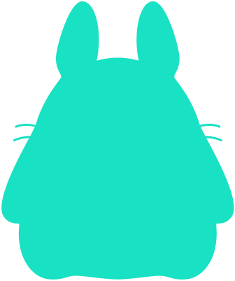
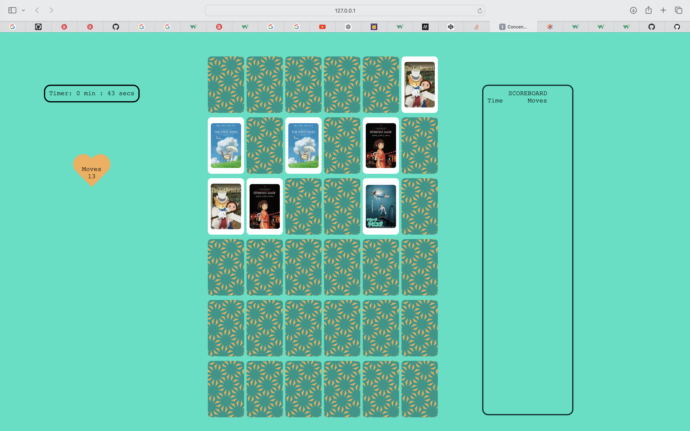

# Concentration matching game

  
  </a>

Concentration matching game tests your ability to find and remember cards you have turned over. Can you match all the cards before you run out of moves or the timer catches you!

### Logo

### Screenshot

## Getting started

### Game Rules

* Match all 36 cards (18 pairs)
* Do not exceed 2 minutes:30 seconds
* You must match all in 50 moves or less
* You can reset the game at any point
* Sound is optional

Game link coming after deployed.

Planning section in this readme.

## Attributions

* Google Image Search for in game images
* [Pattern Monster](https://pattern.monster/) for card background pattern

## Technologies used

* HTML
* CSS
* JavaScript
* JSON

## Next steps

* Add game difficulty level easy, normal, hard and crazy using game rule object
* Flip all cards at the start
* Add more graphics e.g. for win and lose modal
* Add more card images
* Make mobile friendly, if possible
* Save scores for later

## Planning

### Day 1

* ~~Setting up html~~
* ~~Getting modal to work. Modal pop up to appear on page load up.~~
* ~~Ouline main features on css~~
* ~~Getting timer function to start on page load up~~

### Day 2

* ~~Adding images~~
* ~~Getting cards to flip on click. two cards should remain revealed after two clicks, cards to flip back if there is no match.~~
* ~~Count two clicks as a move, add it to the moves counter~~
* ~~Add cards shuffling at start of game and after new game~~

### Day 3

* ~~Get function to work after there is a match~~
* ~~Get buttons to work play, sound on/off, reset & back~~
* ~~Add timing and moves to the scoreboard at the end of the game~~
* ~~Display a win/lose message~~

### Day 4

* ~~Get sound function working~~
* ~~Tidy up the code~~
* ~~Get the visuals as intended~~

### Day 5

* Continue with final touches on visuals
* Complete the README.md
